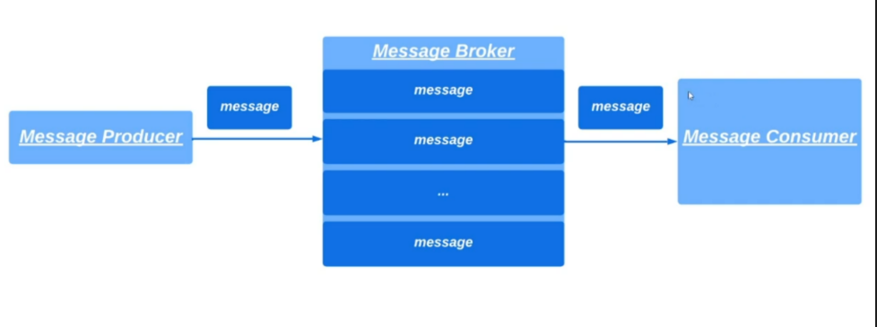
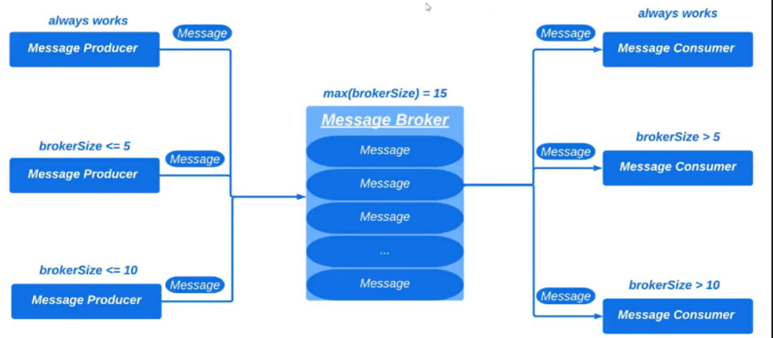
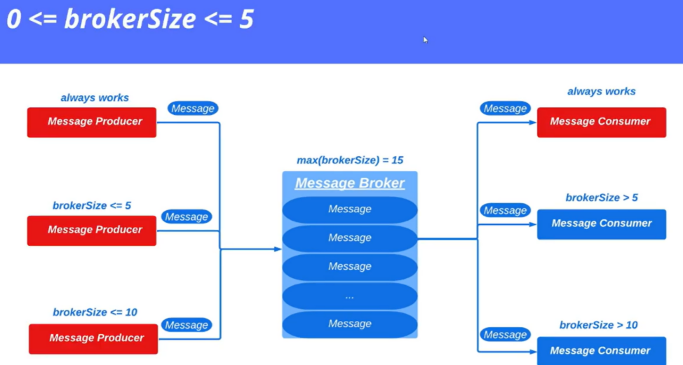
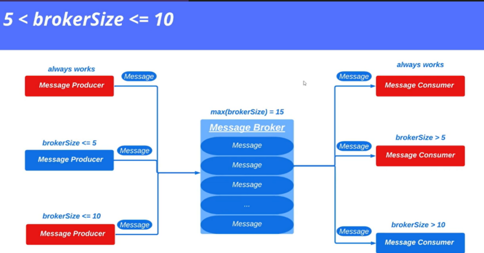
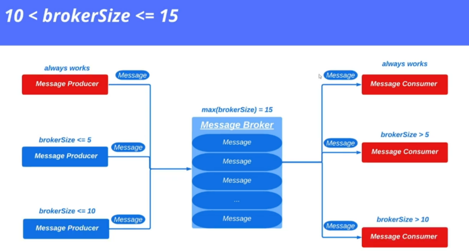

# Усложненная задача потребителя и производителя. 

В прошлой задаче решена проблема производителя и потребителя при помощи методов wait() и notify().  
Иллюстрация задачи:

## Усложненная задача
* Три потока-производителя и три потока-потребителя
* Размер брокера (**brokerSize**) сообщений увеличен до 15

Также дополнительные условия по работе потоков, в зависимости от заполненности брокера изображены ниже:

